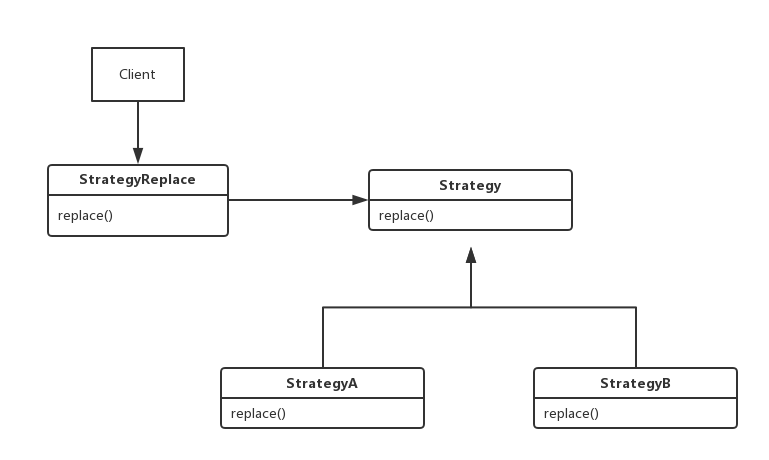
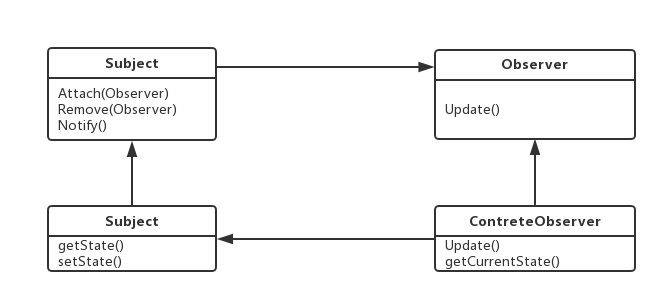
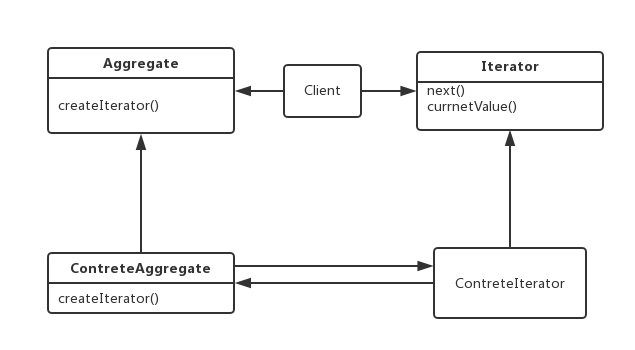
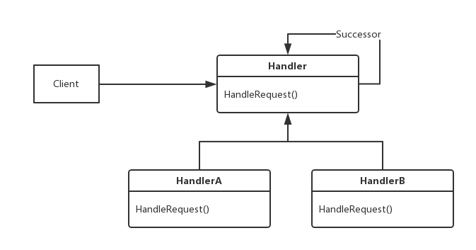
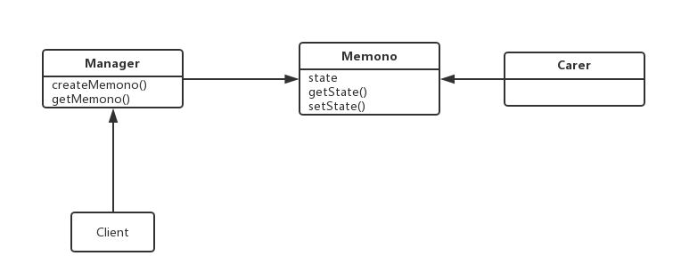
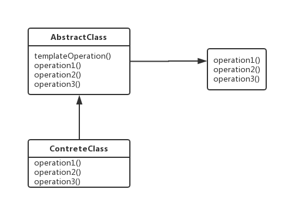
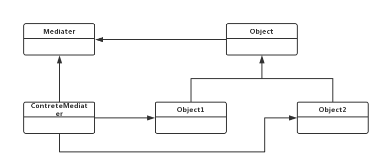
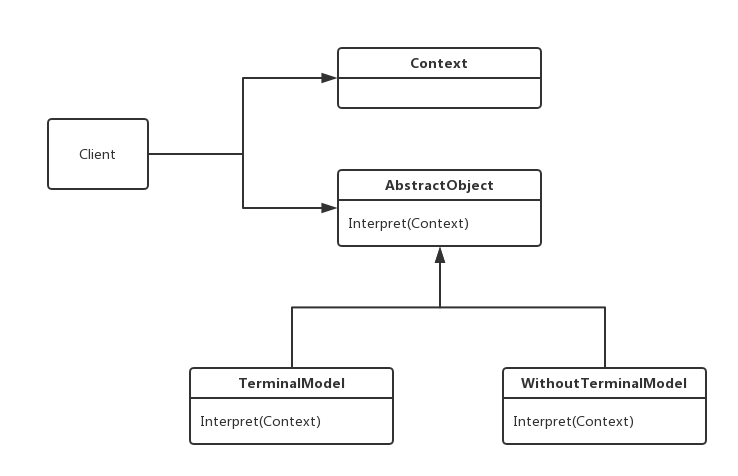

#设计模式

[toc]
设计模式(Design Patern)
##一、设计模式的分类
　　设计模式总的来说分为三大类：
　　1. 创建型模式（五种）：工厂模式、抽象工厂模式、单例模式、构建器模式、原型模式。
　　2. 结构型模式（七种）：适配器模式、装饰器模式、代理模式、外观模式、桥接模式、组合模式、享元模式。
　　3. 行为型模式（十一种）：策略模式、模板方法模式、观察者模式、迭代子模式、责任链模式、命令模式、备忘录模式、状态模式、访问者模式、中介者模式、解释器模式。 

##二、设计模式遵循的六大原则
###1、开闭原则（Open Close Principle）
　　开闭原则意味着开放扩展，关闭修改。意味着当需求变化时只扩展模块的功能,不具体的修改模块的源代码,实现一种热拔插的效果。这样做的好处是易于项目的扩展升级和维护。开闭原则的实现方式是对系统进行抽象，形成一个抽象层，当遇到新需求时可以从底层导出相应的实现。
###2、里氏代换原则（Liskov Substitution Principle）
　　里氏替换原则，OCP作为OO的高层原则，主张使用“抽象(Abstraction)”和“多态(Polymorphism)”将设计中的静态结构改为动态结构，维持设计的封闭性。“抽象”是语言提供的功能。“多态”由继承语义实现。 里氏替换原则中说，任何基类可以出现的地方，子类一定可以出现。 LSP是继承复用的基石，只有当衍生类可以替换掉基类，软件单位的功能不受到影响时，基类才能真正被复用，而衍生类也能够在基类的基础上增加新的行为。
###3、依赖倒转原则（Dependence Inversion Principle）
　　高层次的模块不应该依赖于低层次的模块，他们都应该依赖于抽象。抽象不应该依赖于具体实现，具体实现应该依赖于抽象。
###4、接口隔离原则（Interface Segregation Principle）
　　客户端不应该依赖它不需要的接口；一个类对另一个类的依赖应该建立在最小的接口上。基本意思是降低接口之间的耦合度，为系统的维护和升级带来便利。
###5、迪米特法则（最少知道原则）（Demeter Principle）
　　又叫作最少知道原则（Least Knowledge Principle 简写LKP），就是说一个对象应当对其他对象有尽可能少的了解,不和陌生人说话。英文简写为: LoD。即一个软件实体应当尽可能少的与其他实体发生相互作用。每一个软件单位对其他的单位都只有最少的知识，而且局限于那些与本单位密切相关的软件单位。
###6、合成复用原则（Composite Reuse Principle）
　　尽量使用合成/聚合的方式，而不是使用继承。
##三、具体的23种设计模式
###1、创建型模式
####（1）、工厂模式（Factory Method）
　　工厂模式用于实例化对象，类似于C++中的new，相对于new来说更加容易管理。工厂方法模式又分为三种：
#####1）、简单工厂模式
　　简单工厂模式根据需求从一个工厂中创建需要的实例，缺点是当有新需求时需要修改工厂类适配需求。相关代码如下：
```cpp
	//基类
	class vehicle
	{
	public:
		virtual void run() = 0;
	};

	class car :public vehicle
	{
	public:
		virtual void run()
		{
			std::cout << "car run" << std::endl;
		}
	};

	class truck :public vehicle
	{
	public:
		virtual void run()
		{
			std::cout << "truck run" << std::endl;
		}
	};

	enum vehicle_type
	{
		CAR,TRUCK
	};

	//工厂类
	class Factory
	{
	public:
		vehicle* create(vehicle_type type)
		{
			switch (type)
			{
			case CAR:
				return new car();
				break;
			case TRUCK:
				return new truck();
				break;
			default:
				break;
			}
		}
	};
```
　　上述代码中所有的交通工具由工厂Factory根据类型进行生产，当需要添加新的vechile时就需要修改工厂类添加新的代码。这样做就违反了开放封闭原则即可扩展不可修改。

#####2）、工厂方法模式
　　简单工厂方法违法了开放封闭原则，因此出现了工厂方法来弥补其缺陷，简单说来就是将简单工厂中的判断交由客户端处理，即工厂只提供一个接口，具体的实现由工厂的子类实现，具体的子类工厂创建具体的实例。当需要增加新的产品时不需要对工厂进行修改只需简单的扩展即可。
　　代码如下：
```cpp
	//基类
	class vehicle
	{
	public:
		virtual void run() = 0;
	};

	class car :public vehicle
	{
	public:
		virtual void run()
		{
			std::cout << "car run" << std::endl;
		}
	};

	class truck :public vehicle
	{
	public:
		virtual void run()
		{
			std::cout << "truck run" << std::endl;
		}
	};

	class Factory
	{
	public:
		virtual vehicle* create() = 0;
	};

	class FactoryCar :public Factory
	{
	public:
		vehicle* create()
		{
			return new car();
		}
	};

	class FactoryTruck :public Factory
	{
	public:
		vehicle* create()
		{
			return new truck();
		}
	};
```
　　上述代码中，提供了一个Factory接口然后再为每一个产品具体实现一个工厂类由该工厂类全权负责该对象的实例化，相对于简单工厂模式遵守了开放封闭原则，但是也并不是说工厂方法模式相对于简单工厂模式好得多，因为没需要实例化一种产品我们都需要为相应的对象添加具体的工厂类，如果产品过多就会过于冗余。

#####3）、抽象工厂模式
　　抽象工厂模式定义了一个创建一系列相关或相互依赖的接口，而无需指定它们的具体类。
　　代码如下：
```cpp
	//基类
	class vehicle
	{
	public:
		virtual void run() = 0;
	};

	class car :public vehicle
	{
	public:
		virtual void run()
		{
			std::cout << "car run" << std::endl;
		}
	};

	class truck :public vehicle
	{
	public:
		virtual void run()
		{
			std::cout << "truck run" << std::endl;
		}
	};

	class ship
	{
	public:
		virtual void sail() = 0;
	};

	class Vessel :public ship
	{
	public:
		virtual void sail()
		{
			std::cout << "vessel" << std::endl;
		}
	};

	class boat :public ship
	{
	public:
		virtual void sail()
		{
			std::cout << "boat" << std::endl;
		}
	};

	class Factory
	{
	public:
		virtual vehicle* createCar() = 0;
		virtual ship* createShip() = 0;
	};

	class FactorySmall :public Factory
	{
	public:
		vehicle* createCar()
		{
			return new car();
		}

		ship* createShip()
		{
			return new boat();
		}
	};

	class FactoryBig :public Factory
	{
	public:
		vehicle* createCar()
		{
			return new truck();
		}

		ship* createShip()
		{
			return new Vessel();
		}
	};
```


　　简单的总结一下，简单工厂模式基本意思是所有的实例化工作交由单一的工厂进行处理，不利于后期扩展，扩展需要修改工厂类；工厂方法将实例化工作交由具体的工厂类实现，所说遵守了开放闭合原则，但是需要为每一个类创建一个具体的工厂，当项目达到一定规模时，容易造成冗余；抽象工厂是对工厂方法的一种扩展。举个例子就是，假如现在有A，B两个产品，简单工厂就是将AB两个产品同时交由厂商F生产；而工厂方法是有两个分别专门生产A，B的厂商FA，FB；抽象工厂可以理解为现在A，B产品非别处理加强版AG，BG，FA厂本身有生产A的技术，生产FA也不在话下只需简单的升级即可，FB同理，两个工厂虽然产品不同但是都是生产一个产品和其加强版，因此将其抽象为一个接口即可。
 
####（2）、单例模式（Singleton）
　　单例模式顾名思义就是指让类的对象只存在一个实例。下面是一种比较常见的方式，将构造函数私有化，利用另外的接口获取单例：
```cpp
	class Singleton
	{
	private:
		static Singleton* _single;
		Singleton(){}
	public:
		static Singleton* getInstance()
		{
			if (_single == nullptr)
			{
				_single = new Singleton();
			}

			return _single;
		}
	};

	Singleton* Singleton::_single = nullptr;
```
　　还可以按照下面的方式创建单例,利用静态变量只在初始化的第一次初始化的时候执行相应的初始化的特性：
```cpp
	class SingleTon
	{
	private:
		SingleTon(){}
	public:
		static SingleTon* getInstance()
		{
			static SingleTon *single = new SingleTon();
			return single;
		}
	};
```
####（3）构建器模式（Builder）
　　构建器模式是指将对象的构建与表示分离，使得同样的构建过程可以创建不同的表示。比如一辆汽车有很多不同的组件比如轮胎，车身，发动机等，构建时完全可以将这几个部分的建造和汽车本身控制最后所有组件的组织逻辑。
```cpp
	#include <iostream>

	class Builder
	{
	public:
		virtual void buildEngine() = 0;
		virtual void buildBody() = 0;
		virtual void buildTires() = 0;
	};

	class TruckBuilder:public Builder
	{
	public:
		virtual void buildEngine()
		{
			std::cout<<"Truck engine";
		}

		virtual void buildBody()
		{
			std::cout<<"Truck body";
		}

		virtual void buildTires()
		{
			std::cout<<"Truck tires";
		}
	};

	class CarBuilder:public Builder
	{
	public:
		virtual void buildEngine()
		{
			std::cout<<"car engine";
		}

		virtual void buildBody()
		{
			std::cout<<"car body";
		}

		virtual void buildTires()
		{
			std::cout<<"car tires";
		}
	};

	class BuildControler
	{
	private:
		Builder *_builder;
	public:
		BuildControler(Builder* builder):_builder(builder){}
		void create()
		{
			_builder->buildBody();
			_builder->buildEngine();
			_builder->buildTires();
		}
	};


	// int main()
	// {
	//     TruckBuilder builder;
	//     BuildControler con(&builder);
	//     con.create();
	// }
```
　　和工厂模式不同之处为工厂模式主要负责筛选创建对象，具体的构建细节不由工厂控制，而构建器能够控制具体的构建逻辑。


####（4）原型模式（Protype）
　　原型模式是从一个对象创建另一个可定制对象的过程，其核心是拷贝，即拷贝当前对象。
　　代码如下：
```cpp
	/*
	 * Prototype 
	 */

	#include <iostream>

	class Prototype
	{
	protected:
		std::string name;
	public:
		Prototype(){}
		virtual void setName(std::string nam)
		{
			name = nam;
		}

		virtual Prototype* clone() = 0;
		virtual void show(){}

		virtual ~Prototype(){}
	};

	class PrototypeA:public Prototype
	{
	public:
		PrototypeA (std::string nam):name(nam){}
		PrototypeA(Prototype &p)
		{
			name = p.name;
		}

		Prototype* clone()
		{
			return new PrototypeA(*this);
		}

		virtual void show()
		{
			std::cout<<"Prototype A";
		}

		virtual void setName(std::string nam)
		{
			this->name = nam;
		}
	};
```
　　其中setName就是提供的自定义接口。使用时只需创建一个Prototype对象即可，当需要更多同类型时只需利用clone进行拷贝即可。


###2、结构型模式
####（1）适配器模式（Adapter）
　　适配器模式是当客户的接口系统无法提供客户需要的接口时，可使用适配器模式将一个接口转换为另一个客户希望的接口以达到兼容性工作的目的。比如一个组件Z有两种功能A，B，而现如今需要的是两个分别具有A,B功能的组件，则可以用具有全功能的组件Z实现，Z就是这里的适配器。
　　代码如下：
　　类适配器
```cpp
	//类适配器
	//需求
	class Target
	{
	public:
		virtual void Request(){};
	};

	//现有接口
	class Adaptee
	{
	public:
		void SpecificRequest()
		{
			std::cout<<"Called SpecificRequest()"<<std::endl;
		}
	};

	//适配
	class Adapter : public Adaptee, public Target
	{
	public:
		void Request()
		{
			this->SpecificRequest();
		}
	};
```
　　对象适配器
```cpp
	//对象适配器
	class Target
	{
	public:
		virtual void Request(){};
	};

	class Adaptee
	{
	public:
		void SpecificRequest()
		{
		cout<<"Called SpecificRequest()"<<endl;
		}
	};

	class Adapter : public Target
	{
	private:
		Adaptee *adaptee;
	public:
		Adapter()
		{
			adaptee = new Adaptee();
		}
		void Request()
		{
			adaptee->SpecificRequest();
		}
	};
```
 

 
####（2）装饰器模式（Decorator）
　　装饰器模式动态地给一个对象添加一些额外的职责（不重要的功能，只是偶然一次要执行），就增加功能来说，装饰模式比生成子类更为灵活。建造过程不稳定，按正确的顺序串联起来进行控制。在不影响其他对象的情况下，以动态、透明的方式给单个对象添加职责。处理那些可以撤消的职责。当不能采用生成子类的方法进行扩充时。一种情况是，可能有大量独立的扩展，为支持每一种组合将产生大量的子类，使得子类数目呈爆炸性增长。另一种情况可能是因为类定义被隐藏，或类定义不能用于生成子类。
```cpp
	/*
	 *  Decorator
	 */
	#include <iostream>

	class Mechine  
	{  
	private:  
		std::string _name;  
	public:  
		Mechine(std::string tmp) :_name(tmp){}  
		Mechine(){}  
		virtual void show() = 0;
	};  

	class AirCondition:public Mechine
	{
	public:
		AirCondition(std::string name):Mechine(name){}
		AirCondition(){}
		virtual void show()
		{
			std::cout<<"机器的名称是" << _name.c_str();
		}
	};

	class Television:public Mechine
	{
	public:
		Television(std::string name):Mechine(name){}
		Television(){}
		virtual void show()
		{
			std::cout<<"机器的名称是" << _name.c_str();
		}
	};

	class Decorator:public Mechine  
	{  
	protected:  
		Mechine* _person;   //要进行装饰的类
	public:  
		Decorate(Mechine* tmp)  
		{  
			_person = tmp;  
		}  

		virtual void show()  
		{  
			_person->show();  
		}  
	};  

	class AirDecorator :public Decorator  
	{  
	public:  
		AirDecorator(Mechine *tmp):Decorator(tmp){}
		virtual void show()  
		{  
			this->ExternalFunction();
			Decorator::show();  
		}  

		void ExternalFunction() //额外功能
		{
			//TODO:
		}
	};  

	class TeleDecorator :public Decorator  
	{  
	public:  
		TeleDecorator(Mechine *tmp):Decorator(tmp){}
		virtual void show()  
		{  
			this->ExternalFunction();
			Decorator::show();  
		}  

		void ExternalFunction() //额外功能
		{
			//TODO:
		}
	};  

	/*
	int main()
	{
		Mechine *air = new AirCondition("air");
		Decorator * dec = new TeleDecorator(air);

		dec->show();

		delete air;
		delete dec;
	}*/
```


####（3）代理模式（Proxy）
　　代理模式为其他对象提供一种代理以控制对这个对象的访问。
　　代理模式一般用途如下：
　　1. 远程代理(Remote Proxy)：可以隐藏一个对象在不同地址空间的事实
　　2. 虚拟代理(Virtual Proxy)：通过代理来存放需要很长时间实例化的对象,利用惰性初始化实现
　　3. 安全代理(保护代理ProtectionProxy)：用来控制真是对象的访问权限
　　4. 智能引用(Smart Reference)：当调用真是对象时，代理处理另外一件事
```cpp
	/*
	 * Proxy.cpp
	 */
	#include <iostream>

	class Node
	{
	protected:
		std::string _name;
	public:
		Node(std::string name):_name(name){}
		virtual void display(){}
	};

	class Sprite:public Node
	{
	public:
		Sprite(std::string name):Node(name){}
		virtual void display()
		{
			std::cout<<"sprite display";
		}
	};

	class DisplayProxy:public Node
	{
	private:
		Sprite *_sprite;
	public:
		DisplayProxy(std::string name):Node(name),_sprite(nullptr){}
		virtual void display()
		{
			if(_sprite == nullptr)
			{
				_sprite = new Sprite(Node::_name);
			}

			_sprite->display();
		}

	};
	/*
	int main()
	{
		Node *node = new DisplayProxy("ait");
		node->display();
		delete node;
	}
	*/

```


####（4）外观模式（Facade）
　　外观模式应该是用的很多的一种模式，特别是当一个系统很复杂时，系统提供给客户的是一个简单的对外接口，而把里面复杂的结构都封装了起来。客户只需使用这些简单接口就能使用这个系统，而不需要关注内部复杂的结构。比如编译器的编译过程由不同的模块完成，如预编译，编译，链接，可以将这几个步骤封装为一个接口为用户所使用。
```cpp
	/*
	 *Facade
	 */ 
	#include <iostream>

	class PerCompiler
	{
	public:
		void perCompile()
		{
			std::cout<<"预编译"<<std::endl;
		}
	};

	class Compiler
	{
	public:
		void compile()
		{
			std::cout<<"编译"<<std::endl;
		}
	};

	class Link
	{
	public:
		void link()
		{
			std::cout<<"链接"<<std::endl;
		}
	};

	class Comile
	{
	public:
		void run()
		{
			PerCompiler per;
			Compiler com;
			Link link;

			per.perCompile();
			com.compile();
			link.link();
		}
	};

	/*
	int main()  
	{  
		Compile compiler;  
		compile.run();  
		return 0;  
	}  */
```


####（5）桥接模式（Bridge）
　　桥接模式将抽象部分与实现部分分离，使它们可以独立变化。不是让抽象基类与具体类分离，而是现实系统可能有多角度分类，每一种分类都有可能变化，那么把这种多角度分离出来让它们独立变化，减少它们之间的耦合性，即如果继承不能实现“开放－封闭原则”的话，就应该考虑用桥接模式。
```cpp
	/*
	 *  Brige
	 */ 
	#include <iostream>

	//abstract
	class Application
	{
	public:
		virtual void runApplication() = 0;      //implement
	};

	class LinuxApp:public Application
	{
	public:
		virtual void runApplication()
		{
			std::cout<<"run apache server on linux";
		}
	};

	class WindowsApp:public Application
	{
	public:
		virtual void runApplication()
		{
			std::cout<<"run apache server on Windwos";
		}
	};

	class OperateSystem
	{
	protected:
		Application *_app;
	public:
		void setApplication(Application *app)
		{
			_app = app;
		}

		virtual void runApplication()
		{
			if(_app)
			{
				_app->runApplication();
			}
		}
	};

	class Windows:public OperateSystem
	{
		//TODO:other logic code
	};

	class Linux: public OperateSystem
	{
		//TODO:other logic code
	};

	/*
	int main()
	{
		Application *app = new WindowsApp();
		OperateSystem *sys = new Windows();

		sys->setApplication(app);
		sys->runApplication();

		delete app;
		delete sys;
	}
	*/
```


####（6）组合模式（Composite）
　　将整体和部分一致对待，比如二叉树中的结点，叶子虽然和根节点有区别但是本质上是一样的。
```cpp
	/*
	 *  Composite
	 */ 
	#include <iostream>
	#include <vector>

	class node  
	{  
	protected:  
		std::string _name;  
	public:  
		node(std::string tmp) :_name(tmp){}  
		virtual void addNode(node*) = 0;  
		virtual void show(int depth = 0) = 0;  
	};  

	class leaf :public node  
	{  
	public:  
		leaf(std::string tmp) :node(tmp){}  
		virtual void addNode(node* tmp)  
		{  
		   std::cout << "叶子无法添加组件\n";  
		}  
		virtual void show(int depth = 0)  
		{  
		   std::string tmp = "";  
		   for (int i = 0; i < depth; i++)  
		   {  
			   tmp += "-";  
		   }  

		   tmp += _name;  
		   std::cout << tmp.c_str();  
		}  
	};  

	class root:public node  
	{  
	private:  
		std::vector<node*> _root;  
	public:  
		root(std::string tmp) :node(tmp){}  
		void addNode(node* tmp)  
		{  
		   _root.push_back(tmp);  
		}  

		void show(int depth = 0)  
		{  
		   std::string tmp = "";  
		   for (int i = 0; i < depth; i++)  
		   {  
			   tmp += "-";  
		   }  

		   tmp += _name;  
		   std::cout << tmp.c_str();  
		   std::vector<node*>::iterator it = _root.begin();  
		   for (; it != _root.end(); it++)  
		   { 
			   (*it)->show(depth += 2);  
		   }  
		}  
	}; 
	/*
	int main()
	{
		node *tmp = new root("root");

		node *l1 = new leaf("leaf1");
		node *l2 = new leaf("leaf2");
		node *t = new root("tree");

		node *l3 = new leaf("leaf3");

		t->addNode(l3);

		tmp->addNode(l1);
		tmp->addNode(l2);
		tmp->addNode(t);

		tmp->show();

		delete tmp;
	}*/
```


####（7）享元模式（Flyweight）
　　享元模式运用共享技术有效地支持大量细粒度的对象（对于C++来说就是共用一个内存块啦，对象指针指向同一个地方，或者其他方式）。如果一个应用程序使用了大量的对象，而这些对象造成了很大的存储开销就应该考虑使用。还有就是对象的大多数状态可以外部状态，如果删除对象的外部状态，那么可以用较少的共享对象取代多组对象，此时可以考虑使用享元。 
```cpp
	/*
	 *Flyweight
	 */
	#include <iostream>
	#include <vector>

	class web  
	{  
	protected:
		std::string _name;      //inner data
	public:  
		web(std::string tmp):_name(tmp){}
		std::string getString()
		{
			return _name;
		}

		virtual void use() = 0;  
	};  

	class share_web :public web  
	{    
	public:  
		share_web(std::string tmp) :web(tmp)  
		{}  

		virtual void use()  
		{  
		   std::cout << "共享网站\n";  
		}  
	};  

	class unshare_web :public web  
	{   
	public:  
		unshare_web(std::string tmp) :web(tmp)  
		{}  

		virtual void use()  
		{  
		   std::cout << "不共享网站\n";  
		}  
	};  

	//网站工厂  
	class web_fatory  
	{  
	private:  
		std::vector<web*> _web;  
	public:  
		web_fatory()  
		{  
		}  

		web* getweb(std::string key)  
		{  
		   auto it = _web.begin();
		   for(;it != _web.end();it ++)
		   {
				if((*it)->getString() == key)
				{
					return *it;
				}
		   }

		   _web.push_back(new share_web(key));
		}  

		~web_fatory()
		{
			auto it = _web.begin();
			for(;it != _web.end();it ++)
			{
				delete *it;
			}
		}
	}; 

```


###3、行为型模式
####（1）策略模式（Strategy）
　　 策略模式是指定义一系列的算法，把它们一个个封装起来，并且使它们可相互替换。本模式使得算法可独立于使用它的客户而变化。也就是说这些算法所完成的功能一样，对外的接口一样，只是各自实现上存在差异。
```cpp
	/*
	 *  Strategy
	 */ 
	#include <iostream>
	#include <string>
	using namespace std;

	//抽象接口  
	class ReplaceAlgorithm  
	{  
	public:  
		virtual void Replace() = 0;  
	};  
	//三种具体的替换算法  
	class LRU_ReplaceAlgorithm : public ReplaceAlgorithm  
	{  
	public:  
		void Replace() { cout<<"Least Recently Used replace algorithm"<<endl; }  
	};  

	class FIFO_ReplaceAlgorithm : public ReplaceAlgorithm  
	{  
	public:  
		void Replace() { cout<<"First in First out replace algorithm"<<endl; }  
	};  
	class Random_ReplaceAlgorithm: public ReplaceAlgorithm  
	{  
	public:  
		void Replace() { cout<<"Random replace algorithm"<<endl; }  
	};  

	class Strategy
	{
	private:
		ReplaceAlgorithm *algorithm;
	public:
		Strategy(ReplaceAlgorithm *r):algorithm(r){}
		void replace()
		{
			if(algorithm)
			{
				algorithm->Replace();
			}
		}
	};
```



####（2）模板方法模式（Template Method）
　　函数的执行统一由父类管理，而接口的具体实现由子类完成。
```cpp
	/*
	 * Template Method
	 */
	#include <iostream>

	//不同操作系统的中断处理
	class OperateSystem
	{
	protected:
		virtual void TriggerInterrupt() = 0;        //触发中断
		virtual void SaveContext() = 0;             //保存现场
		virtual void InterruptSoulation() = 0;       //中断处理
		virtual void ReturnContext() = 0;           //返回现场
	public:
		virtual void HandleInterrupt()
		{
			this->TriggerInterrupt();
			this->SaveContext();
			this->InterruptSoulation();
			this->ReturnContext();
		}
	};

	class Windows:public OperateSystem
	{
	private:
		virtual void TriggerInterrupt()        //触发中断
		{
			std::cout<<"Windows trriger\n";
		}

		virtual void SaveContext()             //保存现场
		{
			std::cout<<"Windows save context\n";
		}

		virtual void InterruptSoulation()       //中断处理
		{
			std::cout<<"Windows interrupt soulation\n";
		}

		virtual void ReturnContext()           //返回现场
		{
			std::cout<<"Windows return context\n";
		}
	};

	class Linux:public OperateSystem
	{
	private:
		virtual void TriggerInterrupt()        //触发中断
		{
			std::cout<<"Linux trriger\n";
		}

		virtual void SaveContext()             //保存现场
		{
			std::cout<<"Linux save context\n";
		}

		virtual void InterruptSoulation()       //中断处理
		{
			std::cout<<"Linux interrupt soulation\n";
		}

		virtual void ReturnContext()           //返回现场
		{
			std::cout<<"Linux return context\n";
		}
	};

	int main()
	{
		Linux *linux = new Linux();
		Windows *window = new Windows();

		linux->HandleInterrupt();
		window->HandleInterrupt();
	}
```


####（3）观察者模式（Observer）
　　定义对象间的一种一对多的依赖关系,当一个对象的状态发生改变时, 所有依赖于它的对象都得到通知并被自动更新。
```cpp
	/*
	 *  Observer
	 */ 

	#include <iostream>
	#include <string>
	#include <vector>
	#include <list>

	using namespace std;
	//观察者  
	class Observer    
	{  
	public:  
		Observer() {}  
		virtual ~Observer() {}  
		virtual void Update() {}   
	};  
	//博客  
	class Blog    
	{  
	public:  
		Blog() {}  
		virtual ~Blog() {}  
		void Attach(Observer *observer) { m_observers.push_back(observer); }     //添加观察者  
		void Remove(Observer *observer) { m_observers.remove(observer); }        //移除观察者  
		void Notify() //通知观察者  
		{  
			list<Observer*>::iterator iter = m_observers.begin();  
			for(; iter != m_observers.end(); iter++)  
				(*iter)->Update();  
		}  
		virtual void SetStatus(string s) { m_status = s; } //设置状态  
		virtual string GetStatus() { return m_status; }    //获得状态  
	private:  
		list<Observer* > m_observers; //观察者链表  
	protected:  
		string m_status; //状态  
	};  

	//具体博客类  
	class BlogCSDN : public Blog  
	{  
	private:  
		string m_name; //博主名称  
	public:  
		BlogCSDN(string name): m_name(name) {}  
		~BlogCSDN() {}  
		void SetStatus(string s) { m_status = "CSDN通知 : " + m_name + s; } //具体设置状态信息  
		string GetStatus() { return m_status; }  
	};  
	//具体观察者  
	class ObserverBlog : public Observer     
	{  
	private:  
		string m_name;  //观察者名称  
		Blog *m_blog;   //观察的博客，当然以链表形式更好，就可以观察多个博客  
	public:   
		ObserverBlog(string name,Blog *blog): m_name(name), m_blog(blog) {}  
		~ObserverBlog() {}  
		void Update()  //获得更新状态  
		{   
			string status = m_blog->GetStatus();  
			cout<<m_name<<"-------"<<status<<endl;  
		}  
	};  

	//测试案例  
	int main()  
	{  
		Blog *blog = new BlogCSDN("wuzhekai1985");  
		Observer *observer1 = new ObserverBlog("tutupig", blog);  
		blog->Attach(observer1);  
		blog->SetStatus("发表设计模式C++实现（15）——观察者模式");  
		blog->Notify();  
		delete blog; delete observer1;  
		return 0;  
	}  
```



####（4）迭代器模式（Iterator）
　　当用户所希望的接口系统无法提供时可以用适配器模式将接口转换为另一个接口例如当一类不支持迭代器时，利用类嵌套为目标类添加相应的支持。具体实现参照STL库中的迭代器。




####（5）责任链模式（Chain of Respinsibility）
　　 使多个对象都有机会处理请求，从而避免请求的发送者和接收者之间的耦合关系。将这些对象连成一条链，并沿着这条链传递该请求，直到有一个对象处理它为止。例如公司里的事物处理可以层层递交，直到可以被解决为止（链表）,事务不断向上递交直至完全执行为止。
```cpp
	/*
	 *  Chain of Respondibilty
	 */ 
	#include <iostream>
	#include <string>

	using namespace std;
	//抽象管理者  
	class Manager  
	{  
	protected:  
		Manager *_manager;  
		string _name;  
	public:  
		Manager(Manager *manager, string name):_manager(manager), _name(name){}  
		virtual void DealWithRequest(string name, int num)  {}  
	};  
	//经理  
	class CommonManager: public Manager  
	{  
	public:  
		CommonManager(Manager *manager, string name):Manager(manager,name) {}  
		void DealWithRequest(string name, int num)   
		{  
			if(num < 500) //经理职权之内  
			{  
				cout<<"经理"<<_name<<"批准"<<name<<"加薪"<<num<<"元"<<endl<<endl;  
			}  
			else  
			{  
				cout<<"经理"<<_name<<"无法处理，交由总监处理"<<endl;  
				_manager->DealWithRequest(name, num);  
			}  
		}  
	};  
	//总监  
	class Majordomo: public Manager  
	{  
	public:  
		Majordomo(Manager *manager, string name):Manager(manager,name) {}  
		void DealWithRequest(string name, int num)   
		{  
			if(num < 1000) //总监职权之内  
			{  
				cout<<"总监"<<_name<<"批准"<<name<<"加薪"<<num<<"元"<<endl<<endl;  
			}  
			else  
			{  
				cout<<"总监"<<_name<<"无法处理，交由总经理处理"<<endl;  
				_manager->DealWithRequest(name, num);  
			}  
		}  
	};  
	//总经理  
	class GeneralManager: public Manager  
	{  
	public:  
		GeneralManager(Manager *manager, string name):Manager(manager,name) {}  
		void DealWithRequest(string name, int num)  //总经理可以处理所有请求  
		{  
			cout<<"总经理"<<_name<<"批准"<<name<<"加薪"<<num<<"元"<<endl<<endl;  
		}  
	};  

	int main()  
	{     
		Manager *general = new GeneralManager(NULL, "A"); //设置上级，总经理没有上级  
		Manager *majordomo = new Majordomo(general, "B"); //设置上级  
		Manager *common = new CommonManager(majordomo, "C"); //设置上级  
		common->DealWithRequest("D",300);   //员工D要求加薪  
		common->DealWithRequest("E", 600);  
		common->DealWithRequest("F", 1000);  
		delete common; delete majordomo; delete general;  
		return 0;  
	}  
```



####（6）命令模式（Command）
　　命令模式是将操作的对象和操作的命令分离，可以将命令装载入队列，执行与否可由操作者决定，而且并不影响其他类的新类，可用于撤销操作，可以将命令模式假想为顾客点餐的过程，客户端是客户，命令接受者是服务员，命令可以是不同的菜。客户可以选择点那份菜，（请求命令）服务员可以选择通知命令的与否命令由命令类派生可以列入队列等待执行，可以想象成要求一个厨师做不同的菜肴，厨师一个时刻只能制作一种，而执行的命令队列如同厨师的制作list，执行完全由厨师掌控，而list的制作由服务员从客户需求处得到。
```cpp
	/*
	 *  Command
	 */
	#include <iostream>
	#include <vector>
	class COOK  
	{  
	public:  
		void fish()  
		{  
		   std::cout << "水煮鱼\n";  
		}  
		void tofu()  
		{  
		   std::cout << "千叶豆腐\n";  
		}  
		void beaf()  
		{  
		   std::cout << "牛肉\n";  
		}  
	};  

	class Command  
	{  
	protected:  
		COOK* cooker;  
	public:  
		//可以修改厨师参数  
		Command(COOK* tmp)  
		{  
		   cooker = tmp;  
		}  

		virtual void operate() = 0;  
	};  

	class fish :public Command  
	{  
	public:  
		fish(COOK* tmp) :Command(tmp){}  
		virtual void operate()  
		{  
		   cooker->fish();  
		}  
	};  

	class beaf :public Command  
	{  
	public:  
		beaf(COOK* tmp) :Command(tmp){}  
		virtual void operate()  
		{  
		   cooker->beaf();  
		}  
	};  

	class tofu :public Command  
	{  
	public:  
		tofu(COOK* tmp) :Command(tmp){}  
		virtual void operate()  
		{  
		   cooker->tofu();  
		}  
	};  

	class waiter  
	{  
	protected:  
		std::vector<Command*> _list;  
	public:  
		//点菜  
		void order(Command* tmp)  
		{  
		   _list.push_back(tmp);  
		   std::cout << "点菜成功\n";  
		}  

		void run()  
		{  
		   std::vector<Command*>::iterator it = _list.begin();  
		   while (it != _list.end())  
		   {  
			   (*it)->operate();  
			   it++;  
		   }  
		}  
	};  

	int main()
	{
		waiter *w = new waiter();       //服务员
		COOK *c = new COOK();           //厨师

		tofu *t = new tofu(c);           
		beaf *b = new beaf(c);           

		w->order(t);                    ////点菜豆腐
		w->order(b);                    //点菜牛肉

		w->run();
	}
```


####（7）备忘录模式（Memono）
　　在不破坏封装性的前提下，捕获一个对象的内部状态，并在该对象之外保存这个状态，这样就可以将以后的对象状态恢复到先前保存的状态。适用于功能比较复杂的，但需要记录或维护属性历史的类；或者需要保存的属性只是众多属性中的一小部分时Originator可以根据保存的Memo还原到前一状态。
```cpp
	/*
	 *  Memonoono
	 */ 
	#include <iostream>
	#include <vector>
	#include <string>

	//备忘录类  
	class Memono  
	{  
	public:  
		std::string _state;  
		Memono(std::string tmp)  
		{  
			_state = tmp;  
		}  
	};  

	class Person  
	{  
	public:  
		std::string _state;  
		Memono* create_Memono()  
		{  
			return new Memono(_state);  
		}  
		void setMemono(Memono* tmp)  
		{  
			_state = tmp->_state;  
		}  

		void show()  
		{  
			std::cout << "状态:" << _state.c_str() << std::endl;  
		}  
	};  

	class manager  
	{  
	public:  
		Memono* _Memono;  
	};  


	int main()  
	{  
		Person* p = new Person;  
		p->_state = "sb";  
		p->show();  

		//保存原始状态  
		manager* m = new manager;  
		m->_Memono = p->create_Memono();  

		//修改状态  
		p->_state = "on";  
		p->show();  

		//恢复  
		p->setMemono(m->_Memono);  
		p->show();  

		system("pause");  
		return 0;  
	}  
```



####（8）状态模式（State）
　　状态模式：允许一个对象在其内部状态改变时改变它的行为。对象看起来似乎修改了它的类。它有两种使用情况：（1）一个对象的行为取决于它的状态, 并且它必须在运行时刻根据状态改变它的行为。（2）一个操作中含有庞大的多分支的条件语句，且这些分支依赖于该对象的状态。可以想象一个人一天中有不同的规划，早上，中午，下午。这个人所做的事情可以根据时间点的变化而变化。
```cpp
	/*
	 * State
	 */
	#include <iostream>

	class Work;  
	class State  
	{  
	public:  
		virtual void doSomething(Work*) = 0;  
	};  

	class Work  
	{  
	private:  
		State* _state;  
	public:  
		double hour;  
	public:  
		Work()  
		{  
		   _state = NULL;  
		}  

		void set_state(State* tmp)  
		{  
		   if (_state)  
		   {  
			   delete _state;  
			   _state = NULL;  
		   }  

		   _state = tmp;  
		}  

		void run()  
		{  
		   _state->doSomething(this);  
		}  

	};  

	class night :public State  
	{  
	public:  
		virtual void doSomething(Work* w)  
		{  
		   std::cout << "睡觉!\n";  
		}  
	};  

	class morning :public State  
	{  
	public:  
		virtual void doSomething(Work* w)  
		{  
		   std::cout << "起床!\n";  
		}  
	};  

	class noon :public State  
	{  
	public:  
		virtual void doSomething(Work* w)  
		{  
		   std::cout << "上班!\n";  
		}  
	};  

	int main()
	{
		Work *work = new Work();
		noon *n = new noon();
		morning *m = new morning();

		work->set_state(n);
		work->run();
		work->set_state(m);
		work->run();

		delete work;
		delete n;
		delete m;
	}
```


####（9）访问者模式（Vistor）
　　定义一个操作中的算法的骨架，而将一些步骤延迟到子类中。TemplateMethod 使得子类可以不改变一个算法的结构即可重定义该算法的某些特定步骤。
```cpp
    class male;  
    class female;  
       
    //行为  
    class action  
    {  
    public:  
        virtual void get_male_cl(male* tmp) = 0;  
        virtual void get_female_cl(female* tmp) = 0;  
    };  
       
    //success  
    class success :public action  
    {  
    public:  
        virtual void get_male_cl(male* tmp)  
        {  
           std::cout << "man success\n";  
        }  
        virtual void get_female_cl(female* tmp)  
        {  
           std::cout << "female success\n";  
        }  
    };  
       
    //fail  
    class fail :public action  
    {  
    public:  
        virtual void get_male_cl(male* tmp)  
        {  
           std::cout << "man fail\n";  
        }  
        virtual void get_female_cl(female* tmp)  
        {  
           std::cout << "female fail\n";  
        }  
    };  
       
    class person  
    {  
    public:  
        virtual void accept(action* tmp) = 0;  
    };  
       
    class male :public person  
    {  
    public:  
        virtual void accept(action* tmp)  
        {  
           tmp->get_male_cl(this);  
        }  
    };  
       
    class female :public person  
    {  
    public:  
        virtual void accept(action* tmp)  
        {  
           tmp->get_female_cl(this);  
        }  
    };  
       
    class stuct  
    {  
    private:  
        std::vector<person*> _person;  
    public:  
        void add(person* tmp)  
        {  
           _person.push_back(tmp);  
        }  
        void show(action* tmp)  
        {  
           std::vector<person*>::iterator it = _person.begin();  
           for (; it != _person.end(); it++)  
           {  
               (*it)->accept(tmp);  
           }  
        }  
    };  
```



####（10）中介者模式（Mediator）
　　中介者模式用一个中介对象来封装一系列的对象交互，中介者使各对象不需要显示的相互引用，从而降低耦合；而且可以独立地改变它们之间的交互。可以把中介类想像成一个中介公司。
```cpp
	#include <iostream>
	#include <string>

	class Person;  
	//中介类  
	class mediator  
	{  
	public:  
		virtual void send(std::string msg, Person* tmp) = 0;  
	};  

	//操作对象  
	class Person  
	{  
	protected:  
		mediator* _mediator;  
	public:  
		Person(mediator* tmp) :_mediator(tmp){}  
	};  

	class Renter :public Person  
	{  
	public:  
		Renter(mediator* tmp) :Person(tmp){}  
		void send(std::string msg)  
		{  
			_mediator->send(msg,this);  
		}  

		void notify(std::string msg)  
		{  
			std::cout << "租客获得了消息:" << msg.c_str() << std::endl;  
		}  
	};  

	class HouseProdiver :public Person  
	{  
	public:  
		HouseProdiver(mediator* tmp) :Person(tmp){}  
		void send(std::string msg)  
		{  
			_mediator->send(msg, this);  
		}  
		void notify(std::string msg)  
		{  
			std::cout << "房东获得了消息:" << msg.c_str() << std::endl;  
		}  
	};  

	class med :public mediator  
	{  
	public:  
		Renter* _Renter;  
		HouseProdiver* _HouseProdiver;  
	public: 
		void setRenter(Renter *renter)
		{
			_Renter = renter;
		}
		void setHouseProdiver(HouseProdiver *prodiver)
		{
			_HouseProdiver = prodiver;
		}

		void send(std::string msg, Person* tmp)  
		{  
			if (tmp == _Renter)  
			{  
				_Renter->notify(msg);  
			}  
			else  
			{  
				_HouseProdiver->notify(msg);  
			}  
		}  
	};  


	int main()
	{
		med *m = new med();
		Renter *r =  new Renter(m);
		HouseProdiver *h = new HouseProdiver(m);

		m->setRenter(r);
		m->setHouseProdiver(h);

		m->send("hellp",r);

		delete m;
		delete r;
		delete h;
	}
```



####（11）解释器模式（Interpreter）
　　当有一个语言需要解释执行, 并且你可将该语言中的句子表示为一个抽象语法树时，可使用解释器模式。而当存在以下情况时该模式效果最好：该文法简单对于复杂的文法, 文法的类层次变得庞大而无法管理。此时语法分析程序生成器这样的工具是更好的选择。它们无需构建抽象语法树即可解释表达式, 这样可以节省空间而且还可能节省时间。效率不是一个关键问题最高效的解释器通常不是通过直接解释语法分析树实现的, 而是首先将它们转换成另一种形式。例如，正则表达式通常被转换成状态机。但即使在这种情况下, 转换器仍可用解释器模式实现, 该模式仍是有用的。
```cpp
	/*
	 *  Interrpter
	 */
	#include <iostream>
	#include <string>

	class context  
	{  
	public:  
		std::string _txt_rst;  
		std::string _txt_snd;  
	};  

	class interpreter  
	{  
	public:  
		virtual void run(context*) = 0;  
	};  

	class senior_inter :public interpreter  
	{  
	public:  
		virtual void run(context* tmp)  
		{  
		   std::cout << tmp->_txt_rst.c_str() << "高级解释器\n";  
		}  
	};  

	class inferior_inter :public interpreter  
	{  
	public:  
		virtual void run(context* tmp)  
		{  
		   std::cout << tmp->_txt_rst.c_str() << "次级解释器\n";  
		}  
	};  
```



